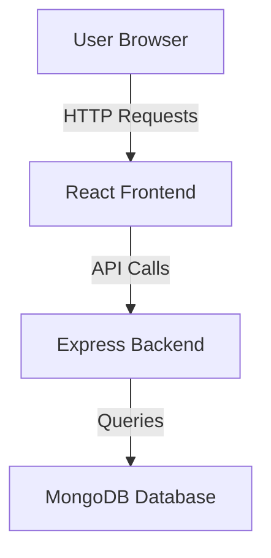
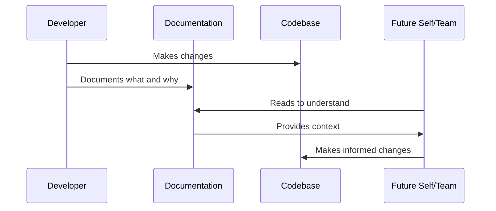
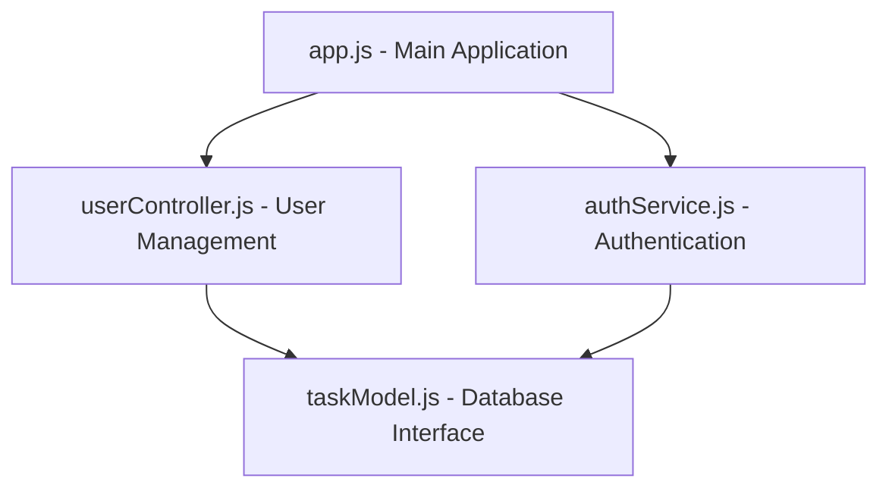

# Chapter 10: System Documentation

In [Chapter 9: Quality Assurance](09_quality_assurance_.md), we explored how to systematically evaluate and improve your code. Now, let's discover how to document your code's structure, evolution, and operational needs through system documentation.

## What Problem Does System Documentation Solve?

Have you ever come back to a project you created months ago and felt completely lost? Or maybe you've joined someone else's project and had no idea how everything fits together or why certain decisions were made?

**Central Use Case**: Imagine you've built a personal task manager app using React and a simple backend. You're proud of it and use it daily. Six months later, you want to add a new feature, but you've forgotten how everything connects and works. Good system documentation would save you hours of rediscovering your own creation!

System documentation is like creating maps, historical records, and user manuals for your code "city." It helps you and others navigate, understand how things evolved, and recover when problems occur.

## The Four Pillars of System Documentation

Let's explore the four main types of system documentation that form a complete picture of your application:

### 1. System Architecture Documentation: Your City Map 🗺️

This shows how your code components relate to each other - like a map of your code city.

```markdown
# TaskMaster App Architecture

## Components
- Frontend: React application with Material-UI
- Backend: Express.js API server
- Database: MongoDB for task storage
- Authentication: JWT-based user authentication
```

This simple markdown file gives an overview of the main parts of our app. Just like a city map shows neighborhoods and major roads, this shows the big pieces of our application without overwhelming detail.

Let's add a simple diagram to make it even clearer:



This diagram visually represents how data flows through our application, making it much easier to understand the system at a glance.

### 2. Change Logs: Your Historical Records 📜

Change logs track how your code evolves over time - like historical records for your code city.

```markdown
# TaskMaster Change Log

## v1.2.0 (2023-12-10)
- Added dark mode theme
- Fixed login error on Safari browsers
- Improved loading speed by optimizing images

## v1.1.0 (2023-11-15)
- Added email notifications for overdue tasks
- Updated dependency packages for security
```

This change log helps you remember what changed and when. If a user reports that something stopped working after an update, you can check what changed in that version to help pinpoint the issue.

### 3. Vendor Contacts: Your External Relationships 🤝

This documents the external services your app depends on - like keeping track of important contacts for your code city.

```markdown
# External Services

## MongoDB Atlas
- Purpose: Database hosting
- Account: taskmaster@example.com
- Dashboard: https://cloud.mongodb.com
- Support: support@mongodb.com

## Mailgun
- Purpose: Email notifications
- API Key: Located in .env file
- Dashboard: https://app.mailgun.com
- Support: https://help.mailgun.com
```

This documentation ensures you don't lose access to critical services your application needs. It's especially helpful when you need to update billing information or contact support.

### 4. Recovery Procedures: Your Emergency Plans 🚨

These are instructions for handling problems - like emergency response plans for your code city.

```markdown
# TaskMaster Recovery Procedures

## Database Connection Failure
1. Check MongoDB Atlas status page
2. Verify network connectivity
3. Check database credentials in .env file
4. Restart the application server

## API Server Crash
1. Check server logs at /var/log/taskmaster.log
2. Verify memory usage isn't excessive
3. Restart the service: `systemctl restart taskmaster`
```

These procedures give you a clear path back to a working state when problems occur. Instead of panicking when something breaks, you have a checklist of steps to follow.

## Creating Effective System Documentation

Let's look at some practical approaches to creating documentation that's actually useful:

### Documentation as Code

Store your documentation alongside your code to keep them in sync:

```
taskmaster/
├── src/              # Application source code
├── docs/             # Documentation directory
│   ├── architecture.md
│   ├── changelog.md
│   ├── vendors.md
│   └── recovery.md
├── README.md         # Quick start guide
└── package.json
```

This approach treats documentation like a first-class citizen in your codebase. When you update code, the documentation is right there, reminding you to update it too.

### Using Templates for Consistency

Templates help ensure your documentation covers all the important aspects:

```markdown
# Component Documentation Template

## Purpose
[What problem does this component solve?]

## Interfaces
[How do other components interact with this one?]

## Dependencies
[What does this component rely on?]

## Key Files
[Where is the code for this component?]
```

Templates like this make documentation easier to write and more consistent to read. You're not starting from scratch each time, just filling in the blanks.

## How System Documentation Works Behind the Scenes

When you create and use system documentation, here's what's happening:



Good documentation creates a virtuous cycle. The knowledge you capture today helps future developers (including your future self) make better decisions about the codebase.

## Practical Documentation Examples

Let's look at some real-world examples for our task manager app:

### Architecture Documentation Example

Here's a more detailed architecture description for a specific component:

```markdown
# Authentication System

## Purpose
Manages user login, registration, and session management.

## Key Components
- AuthController: Handles login/register HTTP requests
- JwtService: Creates and verifies JWT tokens
- UserModel: Database schema for user data
```

This focused documentation helps anyone understand this specific part of the system without having to read through all the code.

### Change Log Entry Example

Here's a detailed change log entry with more context:

```markdown
## v1.2.0 (2023-12-10)

### Added
- Dark mode theme with automatic detection of system preferences
  (See Settings.js for implementation)

### Fixed
- Login error on Safari browsers caused by cookie settings
  (Issue #42)

### Changed
- Optimized images using WebP format, reducing load time by 40%
```

Notice how this change log doesn't just list what changed, but provides context about why changes were made and their impact.

### Recovery Procedure Example

Let's look at a more detailed recovery procedure:

```markdown
## Recovering From Database Corruption

1. Stop the application server:
   ```bash
   systemctl stop taskmaster
   ```
   
2. Restore from the latest backup:
   ```bash
   mongorestore --uri="[connection-string]" backup/latest
   ```
   
3. Restart the application:
   ```bash
   systemctl start taskmaster
   ```
   
4. Verify recovery by checking the admin dashboard
```

This procedure gives clear, step-by-step instructions that anyone can follow, even under the stress of an outage.

## Using AI to Help with System Documentation

AI assistants can be powerful allies in creating and maintaining documentation:

```
Human: Please create a system architecture diagram based on these 
files: app.js, userController.js, taskModel.js, and authService.js.

AI: Based on the files you've mentioned, here's a simple architecture diagram:



This basic diagram shows how your main application file connects to your 
controllers and services, which in turn interact with your database model.
```

AI can help you generate initial documentation that you can then refine and expand. It can also help you keep documentation updated when your code changes.

## Automating Documentation Where Possible

Reduce the burden of documentation by automating what you can:

```javascript
// Example of JSDoc comment that can generate documentation
/**
 * Creates a new task for the specified user
 * @param {string} userId - The ID of the user
 * @param {Object} taskData - The task details
 * @param {string} taskData.title - Task title
 * @returns {Promise<Object>} The created task
 */
function createTask(userId, taskData) {
  // Implementation details
}
```

Tools like JSDoc can automatically generate API documentation from comments in your code. This helps keep your documentation in sync with your code without extra effort.

## Documentation Best Practices

Here are some key tips for effective system documentation:

1. **Document as you go**: Don't leave documentation for "later" (it won't happen)
2. **Keep it simple**: Write clearly and concisely, avoiding jargon when possible
3. **Focus on why, not just what**: Explain reasoning behind decisions
4. **Update when things change**: Outdated documentation can be worse than none
5. **Make it discoverable**: Ensure documentation is easy to find when needed

## Documentation for Different Project Sizes

Your approach to documentation should match your project's size:

### Solo Projects
Focus on documenting enough to help "future you" understand the project:
- Basic architecture overview
- Key design decisions and their rationale
- External dependencies and account information
- Setup instructions for when you return to the project

### Small Team Projects
Add documentation that facilitates collaboration:
- Component ownership and experts
- Coding standards and patterns
- Onboarding guides for new team members
- More detailed architecture documentation

### Larger Projects
Include more comprehensive documentation:
- Detailed subsystem documentation
- Formal architecture decision records
- Complete API documentation
- Thorough operational procedures

## Conclusion

System documentation is your code's memory. It captures not just how your system works today, but why it was built this way and how it has evolved over time. Good documentation saves countless hours of rediscovery and helps prevent repeated mistakes.

Remember that documentation doesn't need to be perfect or exhaustive to be useful. Start simple with the four pillars we've discussed: architecture documentation, change logs, vendor contacts, and recovery procedures. As your project grows, your documentation can grow with it.

Most importantly, documentation should be a living part of your development process, not an afterthought. When treated with care, it becomes an invaluable resource for you, your team, and anyone else who interacts with your code.

By implementing effective system documentation, you've now learned all ten fundamental concepts of Vibe Coding! You're well-equipped to create applications that not only function well but are also maintainable, evolvable, and reflective of your creative vision.

---

