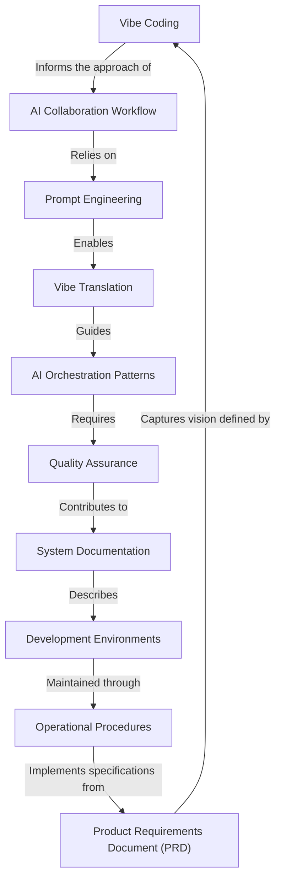

# Tutorial: vibecoding

**VibeCoding** is a methodology for programming with *AI assistance* that views coding as a deeply human activity influenced by psychology, environment, and emotional state. In this approach, humans act as *conductors* who direct AI to transform their creative vision into functional code. The project provides comprehensive guides covering everything from establishing effective AI partnerships to documenting systems and maintaining operational procedures, all united by the philosophy that coding has a "vibe" that affects the final product.

**Source Repository:** [https://github.com/cpjet64/vibecoding](https://github.com/cpjet64/vibecoding)

## Chapters

1. [Vibe Coding
](01_vibe_coding_.md)
2. [Product Requirements Document (PRD)
](02_product_requirements_document__prd__.md)
3. [Prompt Engineering
](03_prompt_engineering_.md)
4. [AI Collaboration Workflow
](04_ai_collaboration_workflow_.md)
5. [Vibe Translation
](05_vibe_translation_.md)
6. [AI Orchestration Patterns
](06_ai_orchestration_patterns_.md)
7. [Development Environments
](07_development_environments_.md)
8. [Operational Procedures
](08_operational_procedures_.md)
9. [Quality Assurance
](09_quality_assurance_.md)
10. [System Documentation
](10_system_documentation_.md)

---

